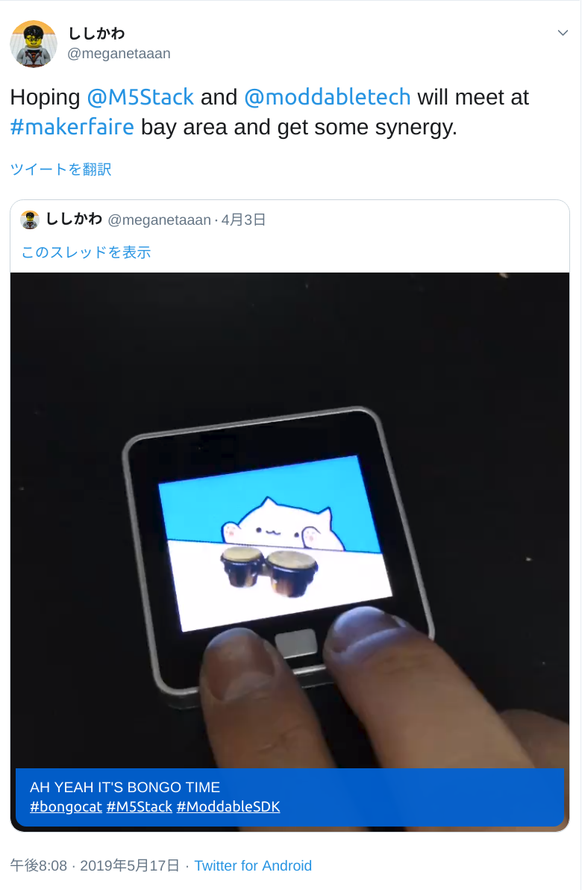

# What I made with Moddable & M5Stack

---

## Me

* On a long journey of Human Computer Interaction
* M5Stack Avatar
  * https://github.com/meganetaaan/m5stack-avatar

\Thank you for your stars/<!-- .element: class="fragment" -->


---

## M5Stack changed my life

* Plunged me down into M5Stack numa <!-- .element: class="fragment" -->
* Got so many maker relationships<!-- .element: class="fragment" -->
* Got my embedded power and interest<!-- .element: class="fragment" -->
* Then changed my job 🖥→🤖<!-- .element: class="fragment" -->
<!-- .element: class="fragment" -->

---

## Meet Moddable SDK


* Offline ready
* Almost full support of the latest ECMAScript features
* Portablility
* UI Friendly

--

## Installation

* A little complicated for newbies
* Installer script by @kimio_kosaka is available
  * https://github.com/kimio-kosaka/Moddable_fun/tree/master/Installer

---

## My Progress on Moddable

1. Applied JavaScript devtools - an experiment
1. Added M5StickC support
1. Made samples! More samples!
1. Made developer relations

---

## 1. Applied JavaScript devtools

* TypeScript
* ESLint
* Prettier

Available on my [project boilerplate](https://github.com/meganetaaan/moddable-boilerplate)

--

* This includes
  * [type declerations](https://github.com/meganetaaan/moddable-boilerplate/blob/master/types/neopixel.d.ts)
  * [configurations](https://github.com/meganetaaan/moddable-boilerplate/blob/master/.eslintrc)

--

## Q. Are Libraries on npm available?

No :\(

* ECMAScript ≠ WHATWG Standards
  * No canvas, svg, fetch etc.
* Limited amount of memory

---

## 2. Added M5StickC support


---

Added manifest.json __-> didn't work__<!-- .element: class="fragment" -->

```json
{
	"defines": {
		"spi": { "mosi_pin": 15, "sck_pin": 13 },
		"ili9341": {
			"hz": 27000000,
			"width": 80, "height": 160,
			"cs_pin": 5, "dc_pin": 23, "rst_pin": 18,
			"spi_port": "VSPI_HOST",
			"registers": [
				"0x01, 0,",
				"...",
			]
		}
	}
}
```

---

Why whese changes didn't work? Because...

---

The backlight was off

---

 Added Axp192 (power management IC) driver

```js
import I2C from 'pins/i2c';
export default class AXP192 extends I2C {
	constructor(it) {
		super(it);
		this.initialize();
	}
	initialize() {
		this.write(0x10, 0xff); // OLED VPP Enable
		this.write(0x28, 0xff); // Enable LDO2&LDO3, LED&TFT 3.3V
		// ...
	}
	setBrightness(brightness) {
		const b = (brightness & 0x0f) << 4;
		this.write(0x28, b);
	}
}
```

---

## It worked!!


---

## Contributed to the official!


--

## ...and to the sales😎


---

# 3. Made samples! More samples!

* https://github.com/meganetaaan/moddable-examples

---

## bongo cat

<video class="stretch" width="30%" src="./assets/bongocat.mp4"></video>

--

draw sprite images and debug on simulator


---

## Thermometer


--

ported DHT12 driver from M5Stack library
```js
import I2C from 'pins/i2c'
export default class DHT12 extends I2C {
  readTemperature (s = this._scale) {
    this.write(0)
    const bytes = this.read(4)
    switch (s) {
      case SCALE.CELSIUS:
        return bytes[2] + bytes[3] / 10
        // ...
    }
  }
  readHumidity () {
    this.write(0)
    const bytes = this.read(2)
    return bytes[0] + bytes[1] / 10
  }
}
```

---

## Color to HEX converter

<video class="stretch" width="30%" src="./assets/color-picker.mp4"></video>

---

## BLE: LINE Things starter

<video class="stretch" width="30%" src="./assets/line-things.mp4"></video>

--

Write APIs in C with esp-idf
```c
// mac-address.c
void mod_get_mac_address(xsMachine* the) {
    uint8_t ret[6];
    int32_t err = esp_efuse_mac_get_default(ret);
    if (err) xsUnknownError("failed to get mac address");
    xsResult = xsArrayBuffer(ret, 6);
}
```

Wrap in JS
```js
// mac-address.js
export default function getMacAdress () @ "mod_get_mac_address";
```

---

## All samples are available on

https://github.com/meganetaaan/moddable-examples

---

# 4. Developer relations

---


Once upon twitterland...

--


--


--

胸熱（SOOO EXCITED!!）


---

## My Future plan width Moddable x M5Stack

* Document translation
* Port M5Stack Avatar into Moddable
* __Write a book__

--

### M5Stack x Moddable SDK fan book

on the next TechBookFest (Sep 22nd)


---

### M5Stack ♡ Moddable

* Well considered appearance
* Ultra fast development
* Many stargazing fans

<!-- .element: class="fragment" -->

Let's try these awesome conbination and feel JavaScript spark!<!-- .element: class="fragment" -->

---

# A request

---

## I wish I would have touch screen

* Moddable strongly supports touch screens
* But M5Stack doesn't


---

## WAIT WHAT


---

## I'll be in _touch_ with you soon...
